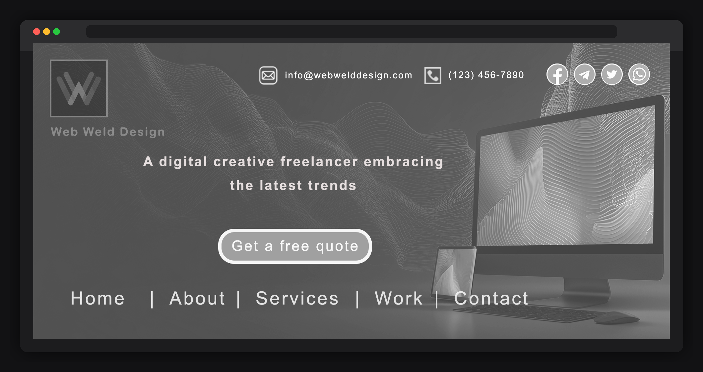
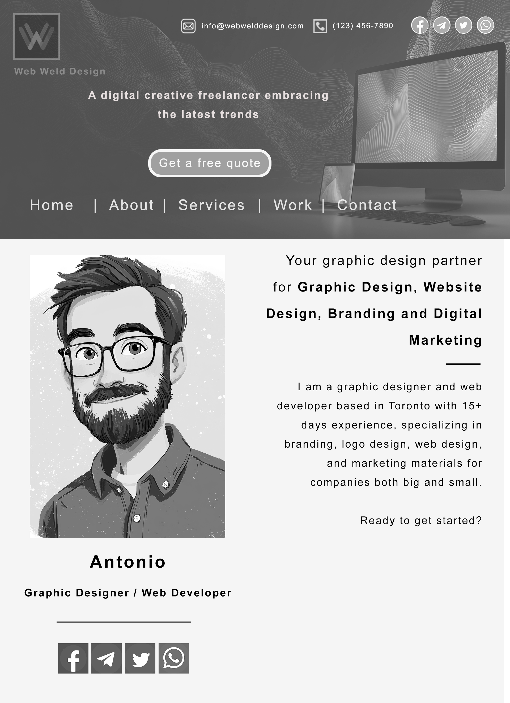
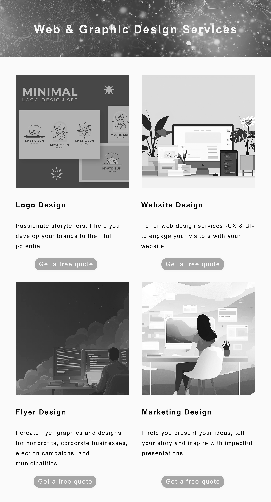
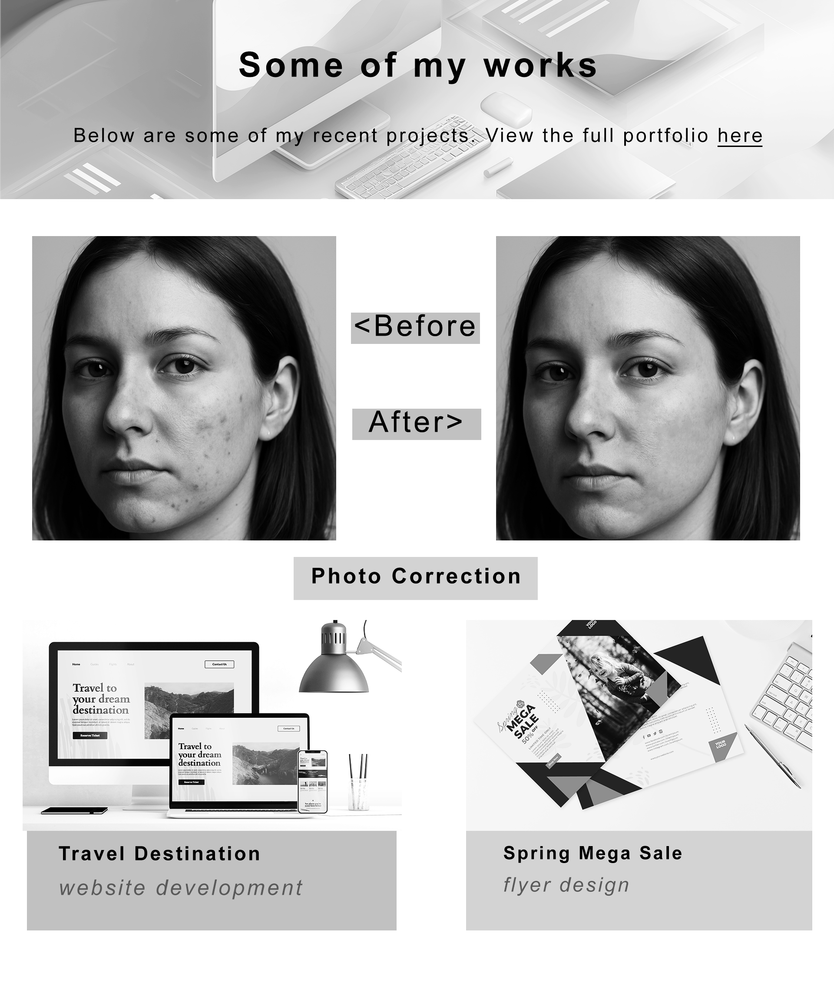
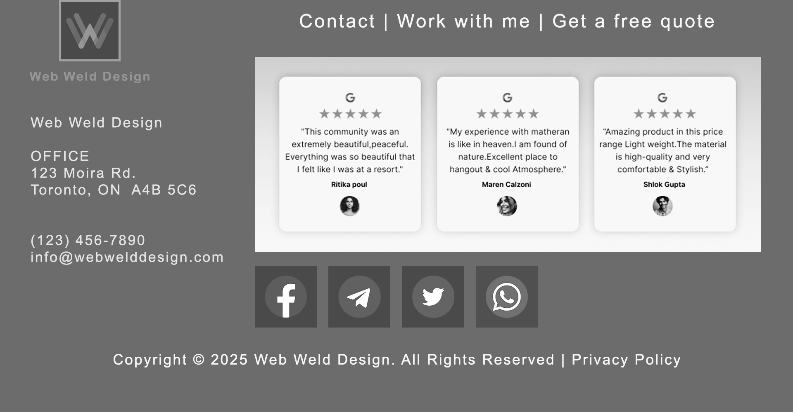
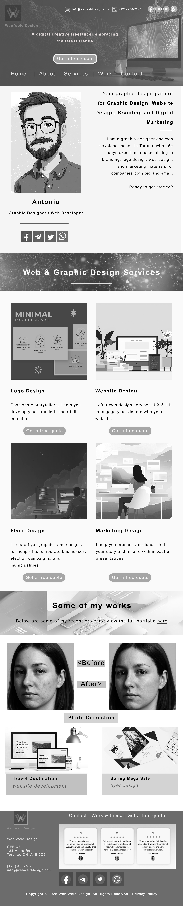

# Web & Graphic Designer Portfolio Concept | UI/UX Design


A conversion-focused personal portfolio and agency landing page designed for creative professionals, UI/UX designers, and graphic artists. Built with a high-contrast editorial monochrome aesthetic, this design prioritizes visual hierarchy, whitespace rhythm, content legibility, and high-impact call-to-actions (CTAs).

---

## 🖥️ Desktop Browser Preview

<div align="center">
  
</div>

---

## 📌 Project Overview

The **Web & Graphic Designer Portfolio Concept** is a comprehensive, multi-section landing page created for creative practitioners (freelancers, art directors, UI/UX engineers, and design agencies). It presents an end-to-end user journey that introduces the creator, displays service offerings, validates skill quality through case studies and before/after photo retouching, provides social proof via Google reviews, and drives inbound lead generation.

- **Primary Brand**: *Web Weld Design*
- **Creative Lead**: Antonio (Graphic Designer & Web Developer)
- **Primary Objective**: Inbound client inquiry conversion ("Get a free quote")
- **Visual Tone**: Modern, editorial, minimalist, structured, authoritative

---

## 💡 Design Rationale & Color Intent

### 1. Minimalist Monochrome Aesthetic
The visual system utilizes an intentional **monochrome / grayscale palette** (`#111111` through `#F5F5F5` and `#FFFFFF`). Rather than a bare wireframe, this is a refined **editorial styling choice**:
- **Content-First Neutrality**: Grayscale structural elements allow featured artwork, branding case studies, and vibrant client projects to stand out without competing against colored UI chrome.
- **Editorial Sophistication**: Clean contrast and monochrome photography create an understated, timeless look reminiscent of modern architecture and fashion design monographs.
- **Accessibility & Contrast**: Strict compliance with WCAG AAA contrast ratios for body copy, buttons, and iconography against light and dark backdrops.

### 2. Guided Visual Hierarchy
The landing page follows a funnel architecture designed to systematically remove client friction:
1. **Immediate Value Proposition (Hero Header)**: Clear service definition, contact availability, and instant CTA above the fold.
2. **Personal Connection (Bio Section)**: Relatable illustrated portrait, location context (Toronto, ON), and direct social channels (Telegram, Twitter/X, WhatsApp, Facebook).
3. **Core Competencies (Services Grid)**: Structured 4-column breakdown (Logo, Web, Flyer, Marketing Design) each paired with dedicated quote request buttons.
4. **Demonstrated Craft (Selected Works)**: High-fidelity mockups across digital products, print collateral, and before/after photo correction proofs.
5. **Trust & Conversion (Social Proof + Footer)**: Authentic 5-star Google review cards, full office address, direct email/phone, and global navigation.

### 3. Dual-Tier Conversion Strategy
Call-to-action buttons ("Get a free quote") are placed at multiple high-intent decision junctures across the page, giving prospective clients immediate access to outreach without having to hunt for contact forms.

---

## 📐 Layout Breakdown

| Section | Focus & Key Elements | Strategic Purpose |
| :--- | :--- | :--- |
| **Hero & Navigation** | Dark textured hero header, brand logo (*Web Weld Design*), direct contact details, primary CTA, desktop device mockup | Immediate brand authority and instant quote inquiry |
| **Creator Intro & Bio** | Hand-drawn stylized portrait, introduction copy, experience summary, direct social links | Humanizes the brand and establishes Toronto-based creative credibility |
| **Services Grid** | 4-card matrix: **Logo Design**, **Website Design**, **Flyer Design**, and **Marketing Design** with individual CTAs | Clarifies scope of services and enables service-specific inquiry flow |
| **Portfolio Showcase** | Multi-discipline showcase featuring **Photo Correction (Before/After)**, **Travel Destination Web App**, and **Spring Mega Sale Flyer** | Proves versatility across photo retouching, responsive UI/UX, and print branding |
| **Social Proof & Footer** | Verified Google 5-star testimonials, office address (`123 Moira Rd, Toronto`), direct email/phone, quick social links, legal copyright | Eliminates buyer hesitation and reinforces physical agency legitimacy |

---

## 🖼️ Visual Showcase

### 1. Hero & Creative Bio Section
> The header establishes instant credibility with contact data in the top bar, paired with an engaging personal biography and illustrated portrait.

<div align="center">
  
</div>

---

### 2. Four-Column Services Grid
> Clear taxonomy dividing creative offerings into Logo Design, Website Design, Flyer Design, and Marketing Design—each supported by custom artwork and micro-CTAs.

<div align="center">
  
</div>

---

### 3. Selected Works & Photo Retouching Showcase
> Demonstrates real-world execution with detailed photo retouching comparisons (Before vs. After skin correction) alongside desktop and print mockups.

<div align="center">
  
</div>

---

### 4. Client Testimonials, Contact & Footer
> Google review cards providing social validation, backed by transparent studio contact details and full footer navigation.

<div align="center">
  
</div>

---

### 5. Full Page Vertical Overview
> Complete 1920 × 9500 px seamless landing page layout.

<details>
<summary><b>Click to expand full vertical blueprint</b></summary>
<br/>
<div align="center">
  
</div>
</details>

---

## 🛠️ Technical Specifications & Tools

- **Design Software**: Adobe Photoshop CC 2025, Adobe Illustrator CC 2025
- **Canvas Resolution**: 1920 × 9500 px (Artboard layout)
- **DPI / PPI**: 72 DPI (Standard Web) / 144 DPI (Retina export ready)
- **Grid Architecture**: 12-Column Responsive Bootstrap/CSS Grid equivalent
- **Color System**:
  - Dark Charcoal (`#1A1A1A` / `#2C2C2E`): Header, footer, dark banners
  - Soft Canvas Light (`#F5F5F5` / `#FAFAFA`): Body background
  - Neutral Pure White (`#FFFFFF`): Card backgrounds, modal surfaces
  - High-Contrast Text (`#111111` / `#333333`): Headlines and lead paragraphs
  - Muted Neutral (`#707070` / `#8E8E93`): Captions, secondary metadata, borders
- **Asset Management**: Git Large File Storage (Git LFS) tracking master `.psd` and `.ai` source files

---

## 📂 Repository Structure

```
designer-portfolio-concept/
├── assets/
│   └── exports/
│       ├── desktop-browser-mockup.png        # Framed desktop presentation
│       ├── hero-section.png                  # Header, hero, and creator bio
│       ├── services-grid.png                 # 4-column design services matrix
│       ├── portfolio-showcase.png            # Photo retouching & case studies
│       ├── contact-footer.png                # Testimonials, contact info & footer
│       └── designer-portfolio-full-mockup.png# Full-page vertical export
├── design/
│   ├── designer-portfolio-landing-page.psd   # Master Photoshop source (Git LFS)
│   ├── logo-vector.ai                        # Brand logo vector master
│   └── observatory-vector-illustration.ai    # Vector illustration asset
├── .gitattributes                            # Git LFS tracking configuration
├── .gitignore                                # Environment & OS exclusion rules
└── README.md                                 # Project documentation
```

---

## 📱 Tips for Portfolio & Social Media Presentation

When publishing this case study on Behance, Dribbble, LinkedIn, or personal portfolio networks:

1. **Browser / Device Framing**: Use the provided `desktop-browser-mockup.png` as the hero cover to give viewers immediate real-world device context rather than an unframed flat graphic.
2. **Carousel Slide Breakdown**:
   - **Slide 1**: Desktop browser mockup of the hero fold with value proposition.
   - **Slide 2**: 4-column service grid showcasing design specializations and custom iconography.
   - **Slide 3**: Portfolio showcase highlighting the Before/After skin retouching comparison.
   - **Slide 4**: Layout breakdown, 12-column grid alignment, typography hierarchy, and color tokens.
3. **Contextual Narrative**: State upfront that the monochrome scheme is an **editorial design decision** built to let client brand colors take center stage while establishing a crisp, modern identity.

---

## 📄 License & Attribution

Designed and maintained by [snaimio](https://github.com/snaimio). All source assets, master PSDs, and vector AI files are structured for portfolio presentation, study, and educational reference.
