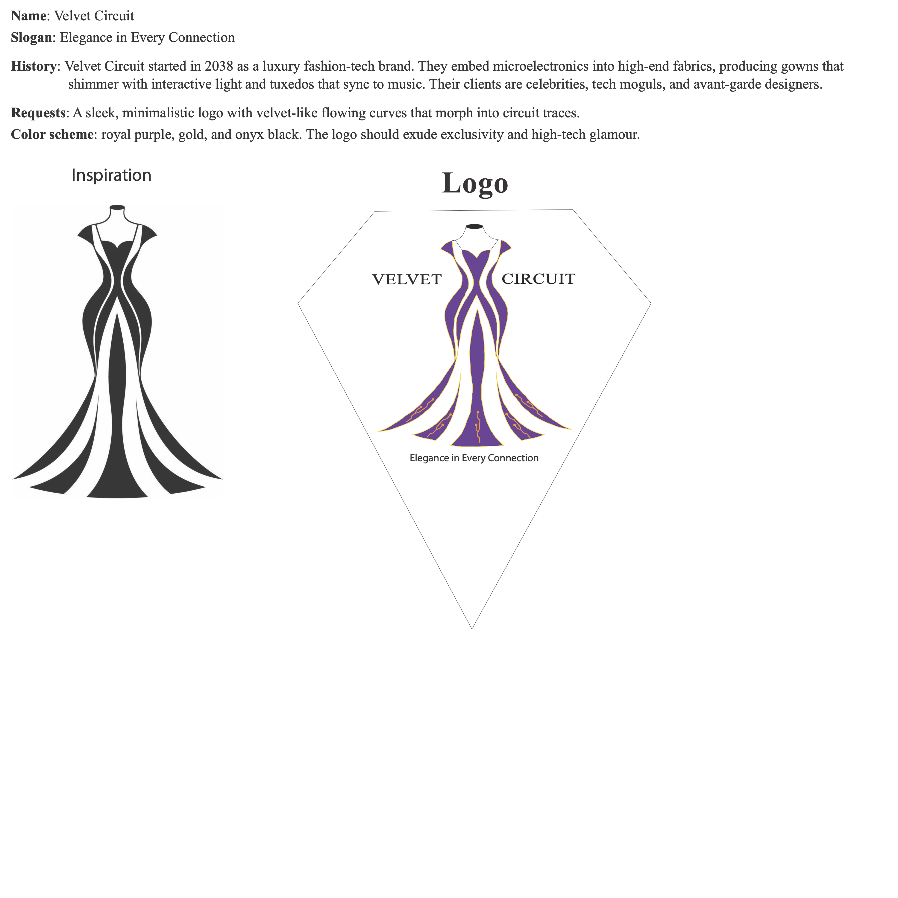
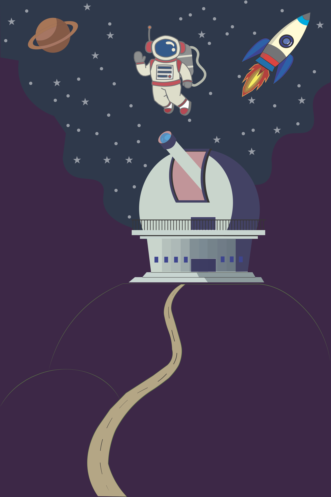

# Web & Graphic Designer Portfolio Concept | UI/UX & Vector Design


A comprehensive design engineering and visual identity project combining a conversion-focused **UI/UX Portfolio Landing Page** with standalone masterworks in **Vector Logo Design & Brand Identity** and **Vector Illustration & Poster Art**. Built with Adobe Photoshop and Adobe Illustrator, this repository exhibits end-to-end creative versatility across digital interfaces, print collateral, brand identity systems, and custom vector illustration.

---

## 🖥️ Desktop Browser Preview

<div align="center">
  
</div>

---

## 📌 Project Overview

The **Web & Graphic Designer Portfolio Concept** demonstrates a multi-disciplinary creative capability engineered for creative leads, digital agencies, and independent design consultants:

- **Brand & Studio**: *Web Weld Design*
- **Creative Director & Designer**: Antonio (Graphic Designer & Web Developer based in Toronto, ON)
- **Primary Capabilities**:
  1. **UI/UX & Web Landing Page Architecture** (Photoshop)
  2. **Vector Logo Design & Corporate Brand Identity** (Illustrator)
  3. **Editorial Poster Design & Thematic Vector Art** (Illustrator)
  4. **High-End Photo Retouching & Complex Compositing** (Photoshop)
- **Core Conversion Objective**: Frictionless inbound lead generation and client discovery ("Get a free quote").

---

## 🎨 Vector Mastery Spotlight

In addition to full-page web interface design, this project highlights specialized vector skillsets authored in **Adobe Illustrator**, demonstrating brand identity construction and complex vector illustration.

```
Master Illustrator Assets:
├── design/logo-vector.ai                         # Brand identity & logo master
└── design/observatory-vector-illustration.ai     # Vector poster art master
```

---

### 👑 Skill Spotlight 1: Vector Logo Design & Brand Identity
> **Master File**: [`design/logo-vector.ai`](design/logo-vector.ai) | **Format**: Native CMYK/RGB Vector Artboard (3000 × 3000 px)

<div align="center">
  
</div>

#### Case Study: *Velvet Circuit – "Elegance in Every Connection"*
- **Client Concept & Background**: Velvet Circuit is an avant-garde luxury fashion-tech brand embedding microelectronics into haute couture eveningwear—producing interactive luminous gowns and sync-enabled garments for galas, red carpets, and tech moguls.
- **Design Brief & Challenge**: Craft a clean, high-prestige vector logo that fuses the flowing elegance of evening gown silhouettes with circuit board trace geometry without feeling overly technical or clinical.
- **Vector Execution & Geometry**:
  - **Inspiration Phase**: Hand-crafted silhouette curves defining the organic posture and flow of an haute couture evening dress.
  - **Diamond Enclosure**: A balanced diamond crest framing the emblem, establishing symmetrical balance and luxury jewel iconography.
  - **Integrated Circuitry**: Fluid purple fabric folds accented with intricate golden electrical trace veins, seamlessly terminating into the typography.
- **Color Palette & Typography**:
  - **Royal Purple (`#5A189A`)**: Conveys royalty, exclusivity, and mystery.
  - **Electric Metallic Gold (`#D4AF37`)**: Signifies premium craftsmanship and conductive power.
  - **Onyx Black & Crisp White**: Provides neutral grounding and sharp reproduction across luxury tags, packaging, and digital storefronts.

---

### 🚀 Skill Spotlight 2: Vector Illustration & Poster Art
> **Master File**: [`design/observatory-vector-illustration.ai`](design/observatory-vector-illustration.ai) | **Format**: Scalable Vector Artwork (2000 × 3000 px, 2:3 Poster Ratio)

<div align="center">
  
</div>

#### Case Study: *Cosmic Observatory & Space Exploration Poster*
- **Theme & Narrative**: A vintage-modern tribute to celestial discovery, capturing the wonder of stargazing, scientific observation, and interstellar spaceflight.
- **Compositional Depth & Multi-Plane Staging**:
  1. **Foreground / Base**: Serpentine winding roadway leading the viewer's eye upward along contoured mountain ridges toward the facility.
  2. **Midground Focal Point**: Modern geometric observatory dome with architectural perspective, open slit aperture, and prominent optical telescope tube.
  3. **Atmospheric Nebula Sky**: A stylized cosmic night sky with deep violet-to-navy gradations, celestial star clusters, and atmospheric contrast.
  4. **Upper Atmosphere Action**: A retro rocket craft with multi-stage plume flame and a cheerful spacewalking astronaut floating in zero gravity adjacent to a ringed planet.
- **Vector Craftsmanship**:
  - Clean bezier line economy allowing infinite resolution scaling for large-format screen printing, art prints, apparel, and digital editorial covers.
  - Harmonious retro-space color blocking blending deep space purples, stark cosmic whites, flame warm tones, and earth-toned mountain ridges.

---

## 💡 Web Design Rationale & Color Intent

### 1. Minimalist Monochrome Aesthetic
The landing page interface utilizes an intentional **high-contrast monochrome palette** (`#111111` to `#FFFFFF`):
- **Editorial Intent**: Rather than a preliminary wireframe, the grayscale layout is an intentional editorial design choice. It delivers a timeless, magazine-like sophistication that gives featured colorful client artwork complete prominence.
- **Visual Clarity & Focus**: Removing extraneous color distractions directs attention directly to layout rhythm, crisp typography, and client proof points.
- **Accessibility**: Meets WCAG AAA compliance across all text sizes, navigational elements, and button surfaces.

### 2. Funnel Hierarchy & Conversion Strategy
The landing page is engineered to eliminate client hesitation through structured pacing:
1. **Hero Header & Value Proposition**: Instant clarity on services with above-the-fold contact channels and quote CTA.
2. **Creator Persona & Experience**: Humanized bio, portrait illustration, and direct messaging channels (Telegram, Twitter/X, WhatsApp, Facebook).
3. **Structured Service Matrix**: 4 distinct service verticals (Logo, Web, Flyer, Marketing) each with dedicated quote triggers.
4. **Demonstrated Craft & Case Studies**: Concrete proof points covering photo retouching before/after, web app UI, and print marketing.
5. **Validation & Contact**: Verified Google reviews, verified studio address, direct contact info, and global footer.

---

## 📐 Layout Breakdown

| Section | Focus & Key Elements | Strategic Purpose |
| :--- | :--- | :--- |
| **Hero & Navigation** | Dark textured hero header, brand logo (*Web Weld Design*), direct contact details, primary CTA, desktop device mockup | Immediate brand authority and instant quote inquiry |
| **Creator Intro & Bio** | Hand-drawn stylized portrait, introduction copy, experience summary, direct social links | Humanizes the brand and establishes Toronto-based creative credibility |
| **Services Grid** | 4-card matrix: **Logo Design**, **Website Design**, **Flyer Design**, and **Marketing Design** with individual CTAs | Clarifies scope of services and enables service-specific inquiry flow |
| **Portfolio Showcase** | Multi-discipline showcase featuring **Photo Correction (Before/After)**, **Travel Destination Web App**, and **Spring Mega Sale Flyer** | Proves versatility across photo retouching, responsive UI/UX, and print branding |
| **Social Proof & Footer** | Verified Google 5-star testimonials, office address (`123 Moira Rd, Toronto`), direct email/phone, quick social links, legal copyright | Eliminates buyer hesitation and reinforces physical agency legitimacy |

---

## 🖼️ Web Landing Page Showcase

### 1. Hero & Creative Bio Section
> The header establishes instant credibility with contact data in the top bar, paired with an engaging personal biography and illustrated portrait.

<div align="center">
  
</div>

---

### 2. Four-Column Services Grid
> Clear taxonomy dividing creative offerings into Logo Design, Website Design, Flyer Design, and Marketing Design—each supported by custom artwork and micro-CTAs.

<div align="center">
  
</div>

---

### 3. Selected Works & Photo Retouching Showcase
> Demonstrates real-world execution with detailed photo retouching comparisons (Before vs. After skin correction) alongside desktop and print mockups.

<div align="center">
  
</div>

---

### 4. Client Testimonials, Contact & Footer
> Google review cards providing social validation, backed by transparent studio contact details and full footer navigation.

<div align="center">
  
</div>

---

### 5. Full Page Vertical Overview
> Complete 1920 × 9500 px seamless landing page layout.

<details>
<summary><b>Click to expand full vertical blueprint</b></summary>
<br/>
<div align="center">
  
</div>
</details>

---

## 🛠️ Technical Specifications & Tools

| Project Component | Tool | Dimensions / Ratio | Color Mode | Primary Asset File |
| :--- | :--- | :--- | :--- | :--- |
| **Portfolio Landing Page** | Adobe Photoshop CC 2025 | 1920 × 9500 px (72/144 DPI) | RGB (Monochrome Editorial) | [`design/designer-portfolio-landing-page.psd`](design/designer-portfolio-landing-page.psd) |
| **Brand Identity & Logo** | Adobe Illustrator CC 2025 | 3000 × 3000 px (1:1 Vector Artboard) | CMYK / RGB Vector | [`design/logo-vector.ai`](design/logo-vector.ai) |
| **Vector Poster Art** | Adobe Illustrator CC 2025 | 2000 × 3000 px (2:3 Poster Ratio) | CMYK / RGB Vector | [`design/observatory-vector-illustration.ai`](design/observatory-vector-illustration.ai) |

### Asset Management & Version Control
- **Git Large File Storage (Git LFS)**: Configured via `.gitattributes` to handle master binary source files (`*.psd`, `*.ai`) efficiently.
- **Export Formats**: Sliced high-resolution PNG previews preserved in `assets/exports/` for web embedding and social media portfolio distribution.

---

## 📂 Repository Structure

```
designer-portfolio-concept/
├── assets/
│   └── exports/
│       ├── desktop-browser-mockup.png        # Framed macOS browser presentation
│       ├── logo-vector-showcase.png          # Logo design & brand identity showcase
│       ├── observatory-poster-showcase.png   # Vector illustration & poster art showcase
│       ├── hero-section.png                  # Header, hero fold & creator bio
│       ├── services-grid.png                 # 4-column design services matrix
│       ├── portfolio-showcase.png            # Photo retouching & case studies
│       ├── contact-footer.png                # Testimonials, contact info & footer
│       └── designer-portfolio-full-mockup.png# Full-page vertical export
├── design/
│   ├── designer-portfolio-landing-page.psd   # Master Photoshop source (Git LFS)
│   ├── logo-vector.ai                        # Brand logo vector master (Git LFS)
│   └── observatory-vector-illustration.ai    # Vector poster illustration master (Git LFS)
├── .gitattributes                            # Git LFS tracking configuration
├── .gitignore                                # Environment & OS exclusion rules
├── LICENSE                                   # MIT License
└── README.md                                 # Comprehensive project documentation
```

---

## 📱 Tips for Portfolio & Social Media Presentation

When publishing this case study across Behance, Dribbble, LinkedIn, or personal portfolio networks:

1. **Browser & Device Mockups**: Lead with `desktop-browser-mockup.png` to give viewers immediate UI context within a modern desktop frame.
2. **Multi-Slide Carousel Strategy**:
   - **Slide 1**: Desktop browser mockup of the hero fold with value proposition.
   - **Slide 2**: 4-column service grid highlighting typography and micro-interactions.
   - **Slide 3**: Logo design spotlight (`logo-vector.ai` - Velvet Circuit brand identity case study).
   - **Slide 4**: Vector poster spotlight (`observatory-vector-illustration.ai` - Cosmic Observatory).
   - **Slide 5**: Portfolio photo retouching comparison (Before vs. After skin correction).
   - **Slide 6**: Design specifications, grid geometry, and typography system.
3. **Contextual Storytelling**: Emphasize the duality of **UI/UX systems thinking** alongside **precision vector execution** (logo creation and poster illustration) to demonstrate full-spectrum design leadership.

---

## 📄 License & Attribution

This project is open source and available under the terms of the **[MIT License](LICENSE)**.

Copyright (c) 2026 **Sheikh Naim** ([@snaimio](https://github.com/snaimio)). All source design assets, master PSDs, and vector AI illustrations are provided for portfolio presentation, study, and creative reference.
